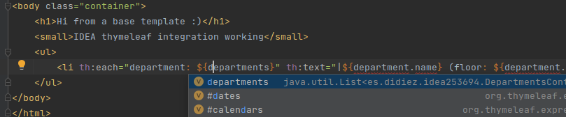
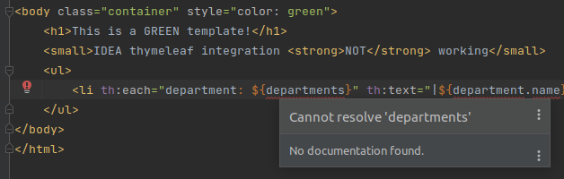

# Sample application to test thymeleaf integration in Intellij IDEA (2021.3.1)

This app registers three `SpringResourceTemplateResolver` beans:
 - `baseTemplateResolver`: simple template resolver configured with a different prefix
 - `fixedTemplateResolver`: custom template resolver implementation, overriding `computeResourceName(..)`, appending a **CONSTANT** path/string to the configured prefix
 - `dynamicTemplateResolver`: custom template resolver implementation, overriding `computeResourceName(..)`, appending a **DYNAMIC** path/string to the configured prefix

IDEA thymeleaf integration is working for the templates resolved by `baseTemplateResolver`

but NOT working for the other two resolvers, as the prefix needs an extra path (constant or dynamic) appended at runtime, implemented in the `computeResourceName` method.

